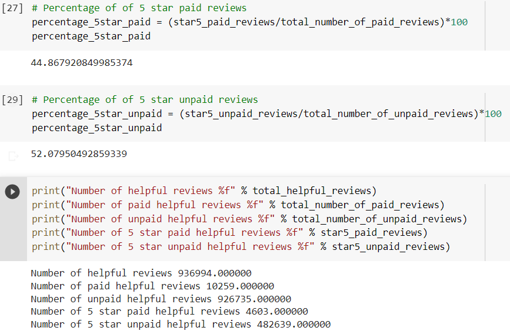

# Amazon_Vine_Analysis
 Module16_Big Data

## Overview: Background & Purpose
BigMarket, a startup company that aids businesses in impriving their marketing based on advanced market analysis, will be working for SellBy to carry out analysis that support the release of products.
SellBy wants to inquire into how their products' reviews compare reviews of products sold by their competitors. They also want to start a program that gives out free products to reviewers and want to determine its usefelness i comparison to its cost.

With the use of AWS RDS, PostgreSQL and PySpark (in Google Collaboratory as the SellBy requested full transperancy) the Amazon Vine data will be anlysed to answer SellBy's proposed questions.

## Analysis & Results
The reviews data, both paid and unpaid, of the electronics category found on Amazon was selected to obtain data for SellBy. This is to determine whether or not there is bias in paid and unpaid reviwes. This was done by addressin the followin questions in regards to the data:

**- How many Vine reviews and non-Vine reviews were there?**
There was a total of 936,994 helpful reviews under the electronics category. 10,259 were Vine reviews, while 926,735 were non-Vine reviews.  

**- How many Vine reviews were 5 stars? How many non-Vine reviews were 5 stars?**
There was a total of 487,242 helpful 5-star reviews under the electronics category. 4,603 were Vine reviews, while 482,639 were non-Vine reviews.  

**- What percentage of Vine reviews were 5 stars? What percentage of non-Vine reviews were 5 stars?**
About 44.9% of Vine reviews were 5 stars. About 52.1% of non-Vine reviews were 5 stars.  

Below is the output of the analysis:

#Summary
Based on the results when comparin Vine and non-Vine reviwes, it can be concluded that a positivity bias is not present in the Vine program where 45% of Vine reviews were 5-stars while 52% of non-Vine reviews were 5-star. This trend may have occurred due to the smaller sample size of Vine users that is around 93 times smaller than non-Vine users.  
In this analysis we looked at 5-star ratings. In the future it may be useful to look at lower ratings and compare Vine and non-Vine reviews to determine if Vine reviews results in users being more critical as a results of bein paid.
